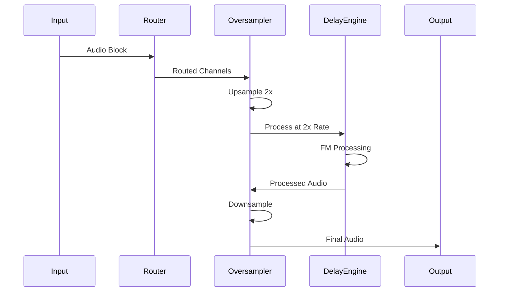

Please note: 
   While I may recognize inspirations or experiment with music
    that is not originally mine in various audio demos, this does not imply
    any official connection or endorsement. AmateurTools has no 
   affiliations with anyone; I am simply a fan. I am not personally 
   connected to, in partnership with, or seeking to capitalize on any 
   famous individuals or companies. If it appears otherwise, that is 
   unintentional. I am an ordinary individual on the internet, not a legal 
   professional or medical expert. Please do not consider anything I say as
    financial, legal, or medical advice.

# 🎛️ FM Engine
**A Modular FM Delay Processor for Creative Audio Production**

This is in the general category of educational tools for students who want to experiment with
aspects of Frequency Modulation, also as an imagination expander.

[](LICENSE)
[](https://juce.com/)
[](https://www.steinberg.net/vst/)
[](https://isocpp.org/)

> **Formerly known as:** Voltage Phase Module (VPM)  
> **Audio Demo:** [Piano Self-Modulation + Sine Waves](https://soundcloud.com/florianhertz/vpm2_2025/)

TODO:
Re-write and try using the builtin JUCE interpolated delay

---

## 🚀 Overview

Think of FM Engine as *just* the FM part of an FM synthesizer. Except it allows the oft dreamt of
applying FM to any two sources, using one as the carrier and one as the modulator. 
Smooth sine shaped modulators sound better, but it can be used in as many ways as you can
imagine. Obviously if you use modulators that contain high frequencies or noise it will just
result in noise, so there's a built in low pass filter. However, try feeding it two different
sine synths, or playing with a single sine synth in mode 1 and play a chord.

### ✨ Key Features

- **🔄 Modular FM Processing** - Pure frequency modulation without oscillators
- **🎯 Audio-Rate Time Modulation** - Delay time modulated by sidechain amplitude
- **📈 Advanced Oversampling** - JUCE built-in with planned SIMD optimization
- **🎛️ Flexible Routing** - Three algorithms supporting mono to full stereo processing
- **⚡ Low Latency** - Precise PDC (Plugin Delay Compensation) support
- **🔊 Multiple Interpolation** - Linear and Lagrange cubic interpolation

---

## 📊 Technical Specifications

### Core Parameters

| Parameter | Range | Default | Description |
|-----------|-------|---------|-------------|
| **Modulation Depth** | 0.0 - 1.0 | 0.0 | Controls FM intensity with 0.5 skew |
| **Max Delay Range** | 10ms/100ms/1000ms | 100ms | Maximum delay time range |
| **Algorithm** | 0-2 | 0 | Routing algorithm selection |
| **Invert** | On/Off | Off | Swaps carrier and modulator |
| **Lowpass Cutoff** | 30Hz - 20kHz | 20kHz | Modulator filtering (log scale) |
| **PDC** | On/Off | Off | Plugin Delay Compensation |
| **Interpolation** | Linear/Lagrange | Linear | Delay line interpolation type |
| **Oversampling** | On/Off | Off | 2x oversampling for quality |

### Processing Equations

The core delay modulation follows these equations:

```
out_L = DelayL(carrier_L, maxDelayLength × lowpass(atan(clipper(modulator_L + 1) × 0.5)))
out_R = DelayR(carrier_R, maxDelayLength × lowpass(atan(clipper(modulator_R + 1) × 0.5)))
```

## 🔧 Building & Installation

### Prerequisites

- **JUCE Framework** 8.07 or higher
- **C++17** compatible compiler
- **CMake** 3.15+ (for CMake builds) or **Projucer**

### Build Instructions

#### Using Projucer
1. Open `FM_Engine.jucer` in Projucer
2. Configure your target IDE/build system
3. Export and build in your IDE

#### Using CMake
```bash
mkdir build
cd build
cmake .. -DCMAKE_BUILD_TYPE=Release
make -j$(nproc)
```

### Installation
1. Copy the built VST3 to your plugin directory:
   - **Windows:** `C:\Program Files\Common Files\VST3\`
   - **macOS:** `~/Library/Audio/Plug-Ins/VST3/`
   - **Linux:** `~/.vst3/`

---

## 🎵 Usage Examples

### Creative Applications

1. **Self-Modulating Instruments**
   - Route piano → Algorithm 0 → Use velocity as modulator
   - Creates dynamic FM textures based on playing dynamics

2. **Sidechain FM Effects**
   - Main: Vocal, Sidechain: Kick drum
   - Algorithm 2 for stereo sidechain modulation
   - Rhythmic vocal texturing

3. **Stereo Image Manipulation**
   - Algorithm 2 with independent L/R sidechain sources
   - Creates complex stereo movement and spatial effects

### Parameter Automation Tips

- **Modulation Depth**: Automate for dramatic build-ups
- **Max Delay Range**: Switch between ranges for different effects
- **Algorithm**: Real-time routing changes for arrangement dynamics
- **Lowpass Cutoff**: Filter sweeps on the modulator signal

---

## 🔬 Technical Deep Dive

### Delay Line Implementation

The `InterpolatedDelay` class features:

- **Circular Buffer**: Efficient memory usage with wraparound
- **Lagrange Interpolation**: 3rd-order polynomial for smooth delays
- **Oversampling Support**: Handles 2x oversampled processing
- **PDC Integration**: Bipolar modulation for advanced timing control

### Routing System

The `routeSample()` function implements three distinct algorithms:

```cpp
// Algorithm 0: Mono Carrier/Modulator
carrier = {L, L}, modulator = {R, R}

// Algorithm 1: Mono Mix
carrier = {(L+R)/2, (L+R)/2}, modulator = {(SC_L+SC_R)/2, (SC_L+SC_R)/2}

// Algorithm 2: Full Stereo  
carrier = {L, R}, modulator = {SC_L, SC_R}
```

### Oversampling Pipeline



---

## 🐛 Troubleshooting

### Common Issues

**No Sidechain Input**
- Ensure your DAW supports sidechain routing
- Check that the sidechain bus is enabled in your DAW
- Verify Algorithm 1 or 2 is selected for sidechain processing

**High CPU Usage**
- Disable oversampling if not needed
- Use Linear interpolation instead of Lagrange
- Reduce the maximum delay range

**Artifacts/Clicking**
- Enable oversampling for complex program material
- Adjust the lowpass cutoff to filter high-frequency modulation
- Check that input levels aren't clipping the modulator

---


## 📚 Background & History

FM Engine evolved from the original **Voltage Phase Module** concept, first documented in a 2014 [Bedroom Producers Blog article](https://bedroomproducersblog.com/2014/06/18/voltage-phase-module/). The project has undergone significant development:

- **2014**: Initial phase modulation concept
- **2024**: Realization that the effect is actually frequency modulation
- **2025**: Complete rewrite with JUCE 8.07 and modern architecture

The name change from "Voltage Phase Module" to "FM Engine" reflects the correct understanding of the underlying DSP principles.

---

## 🤝 Contributing

This is a proprietary plugin developed by AmateurTools DSP. The source code is provided for educational purposes only.

### License

```
Copyright © 2025 AmateurTools DSP (Josh Gura)
All rights reserved.

This software is provided for personal use only.
You may not copy, modify, distribute, sublicense, or sell any part 
of this software, in whole or in part, without explicit, prior 
written permission from the copyright holder.

THE SOFTWARE IS PROVIDED "AS IS", WITHOUT WARRANTY OF ANY KIND, 
EXPRESS OR IMPLIED.
```

---

## 📞 Support

For technical support or questions about FM Engine:

- **Email**: [Contact AmateurTools DSP]
- **Audio Demo**: [SoundCloud Demo](https://soundcloud.com/florianhertz/vpm2_2025/)
- **Original Article**: [Bedroom Producers Blog](https://bedroomproducersblog.com/2014/06/18/voltage-phase-module/)

---

*Built with ❤️ using JUCE 8.07*
