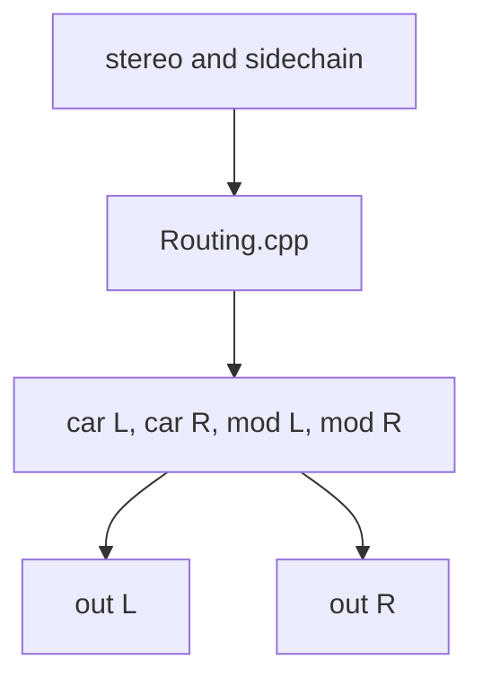

Copyright © 2025 AmateurTools DSP (Josh Gura)

All rights reserved.

This software is provided for personal use only.
You may not copy, modify, distribute, sublicense, or sell any part of this software, 
in whole or in part, without explicit, prior written permission from the copyright holder.

THE SOFTWARE IS PROVIDED "AS IS", WITHOUT WARRANTY OF ANY KIND, EXPRESS OR IMPLIED.

# 🎛️ FM Engine (working title), formerly Voltage Phase Module (Juce 8.07)

> **A modular FM engine designed as a delay with advanced audio-rate modulation, inspired by classic FM synthesis but focused on creative signal processing.**
>[Audio Demo, piano modulating itself, then with Sine waves](https://soundcloud.com/florianhertz/vpm2_2025/)
---

## 📝 Overview

I'm working on a **Juce 8.07 plugin** featuring a well-defined `Delay.cpp` designed as an FM engine.  
This module implements just the FM part typically found in an FM synthesizer—**no actual sound generation** is performed here.

The delay line uses **cubic interpolation** for smooth transitions in delay time, which is standard for time-modulated effects.

---

## ⚡️ Technical Highlights

- **Oversampling:**  
  Currently using JUCE's built-in oversampling. The next step is to implement a SIMD version for greater efficiency (JUCE may include SIMD tools for this purpose).
- **Audio-rate Time Modulation:**  
  The delay is modulated at audio rate by the amplitude of a sidechain signal. This can introduce noise with complex waveforms, so oversampling is key to maximizing useful signal.

---

## 📚 Background

> [Original article about this plugin (2014, Bedroom Producers Blog)](https://bedroomproducersblog.com/2014/06/18/voltage-phase-module/)

The plugin’s name is technically incorrect—originally, I thought it was doing phase modulation, but it’s actually **frequency modulation**. I'm working on correcting this in the project and documentation.

---

## 🔀 Signal Flow (todo: fix this graph)



**Processing equations:**

```cpp
out L = DelayL(carrier L, maxDelayLength * lowpass(atan(clipper(mod L signal + 1) * 0.5)))
out R = DelayR(carrier R, maxDelayLength * lowpass(atan(clipper(mod R signal + 1) * 0.5)))
```

- Take a **bipolar audio signal**, add 1 to make it unipolar, then scale/normalize to 0–1.
- Use this as a multiplier for the maximum delay length, modulating at audio rate.

---

## 🎛️ Controls

- **Second Knob:**  
  Acts as a coarse range control, reporting PDC (lookahead or pre-delay) to the DAW.  
  *Not* intended for automation or frequent adjustment.
- **Leftmost Dial:**  
  Designed for automation or manual tweaking.

---

## 🛠️ Development Notes

- The core FM engine is in `Delay.cpp`.
- Delay time is **cubic interpolated** for smooth modulation.
- **SIMD optimization** is a future goal for oversampling.
- The current modulation scheme can create noise with program material, so maximizing signal quality is a key focus.

---

## 📢 Feedback & Contributions

- Suggestions for improving the oversampling or SIMD implementation are welcome!
- If you have experience with audio-rate delay modulation or FM techniques, please open an issue or PR.

---

*Thank you for checking out this project! For more details, see the [original blog post](https://bedroomproducersblog.com/2014/06/18/voltage-phase-module/) or browse the source code.*

